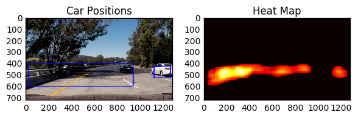

# Vehicle Detection
 
 steps of this project are the following:
 
 
* Perform a Histogram of Oriented Gradients (HOG) feature extraction on a labeled training set of images and train a classifier Linear SVM classifier
* Optionally, you can also apply a color transform and append binned color features, as well as histograms of color, to your HOG feature vector. 
* Note: for those first two steps don't forget to normalize your features and randomize a selection for training and testing.
* Implement a sliding-window technique and use your trained classifier to search for vehicles in images.
* Run your pipeline on a video stream (start with the test_video.mp4 and later implement on full project_video.mp4) and create a heat map of recurring detections frame by frame to reject outliers and follow detected vehicles.
* Estimate a bounding box for vehicles detected.

* [Camera Calibration](#camera-calibration)
* [Image Filters](#image-filters)
* [Finding Multiple Lanes](#finding-multiple-lanes)

The images are generated by the `VehicleDetection.ipynb` notebook.
## Implementation details


## HOG + SVM vehicle detection

We first use the combination of `GTI` and `KITTI` vehicles are non-vehicles for HOG training data.
The number of vehicles is: 8792 and the umber of non-vehicles are:8968. The following are the demonstrations of
vehicle class vs. non-vehicle class:
 

Some mislabelled images are noted by [John Chen](https://github.com/diyjac/SDC-P5/), and there are total
345 of them and they are excluded from SVM training.
Some examples of mislabelled are as follows:
 

### HOG Extraction

Using the configuration `orient=8, pix_per_cell=4, cell_per_block=2`, 
the HOG feature is of dimension of 7200 for an image of size 64*64. 
Following is the HOG visualisation:
 

### SVM classification with normalisation

 
```python
45.0 Seconds to train SVC...
Test Accuracy of SVC =  0.9753
```
## Sliding window approach with heat map generation (video)

With sliding windows set as `xy_window=(128, 128), xy_overlap=(0.5, 0.5)` and the SVC trained by
previous images. We have the following sliding window detection.

Precomputed Sliding windows                                | Precomputed Sliding windows  detection        |                           
:-------------------------:                      |:-------------------------:            |                    
  |   | 

Using the more efficient Hog sub-sampling window search:

Scale: 1                               | Scale: 1.5        |    Scale: 2      |                         
:-------------------------:                      |:-------------------------:            | :-------------------------:            |                                      
  |   |   | 

As we can see, there are so many false positives. And the heat map for a single image (combining from scale: 1, 1.5, 2) is shown as below
and it's quite unsatisfactory.

 

One thing to note is that current `SVC` uses `predict` which introducs a lot of false positive.
Instead, by fiddling around `decision_function` with proper threshold, we can eliminate quite a 
lof of false positives.

As we can see, there are so many false positives. And the heat map for a single image (combining from scale: 1, 1.5, 2) is shown as below
and it's quite unsatisfactory.

SVC decision function (threshold: 300)                           | Multiscale fusion (scale: [1, 1.5, 2])        |                 
:-------------------------:                      |:-------------------------:            |                                  
  |   |  

