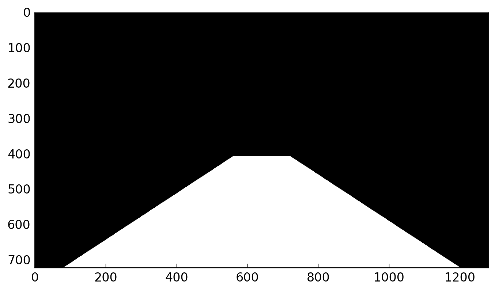
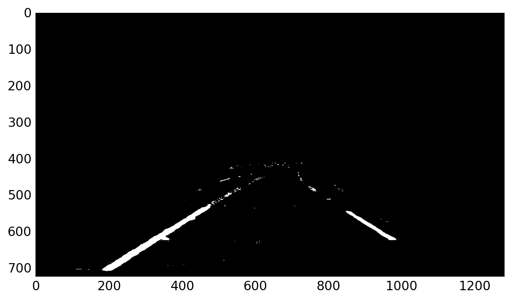
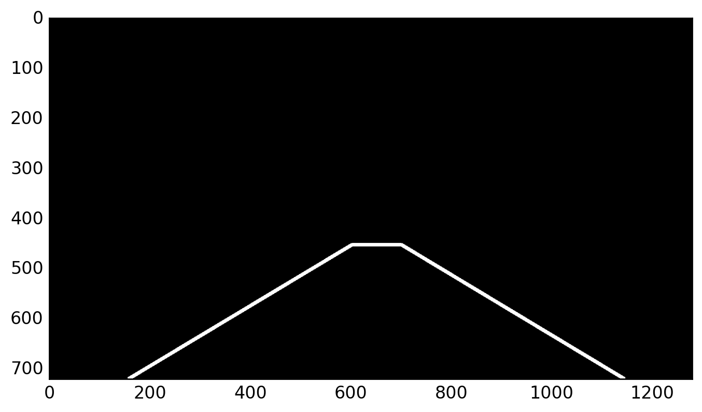
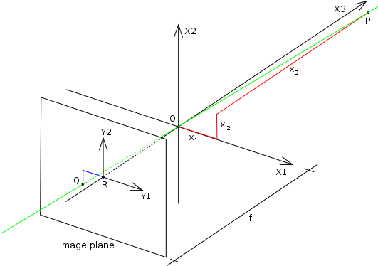
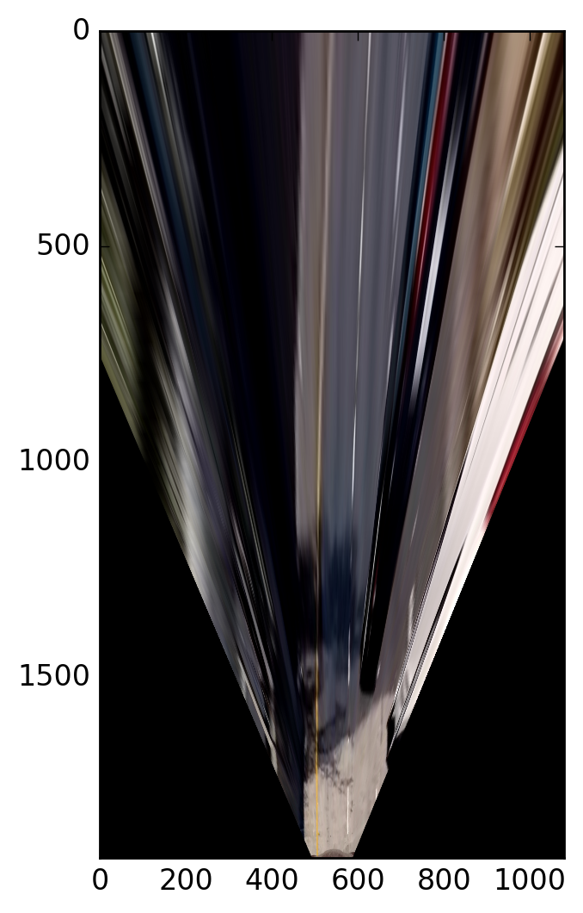
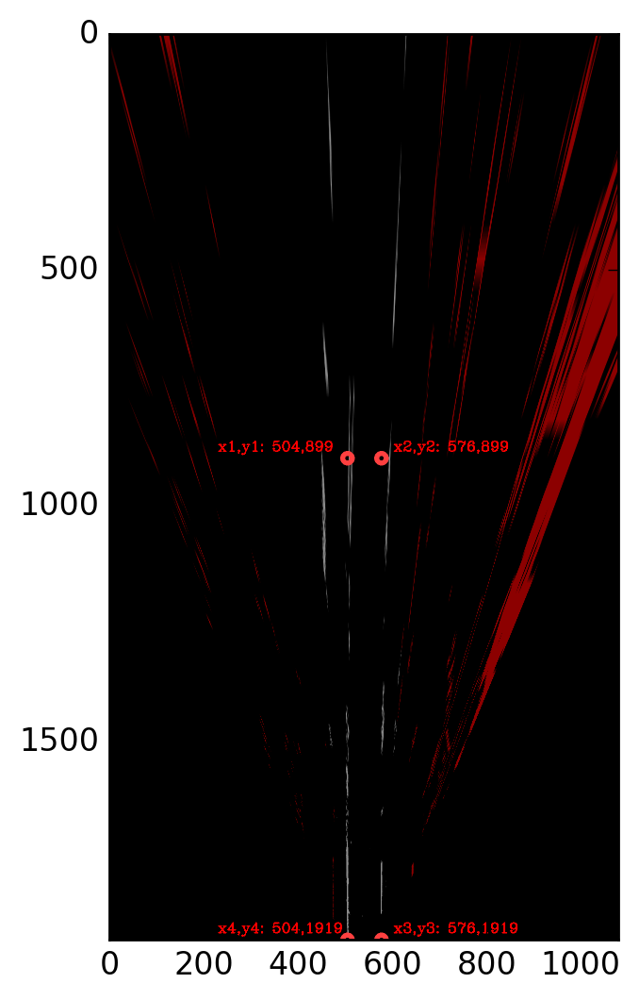
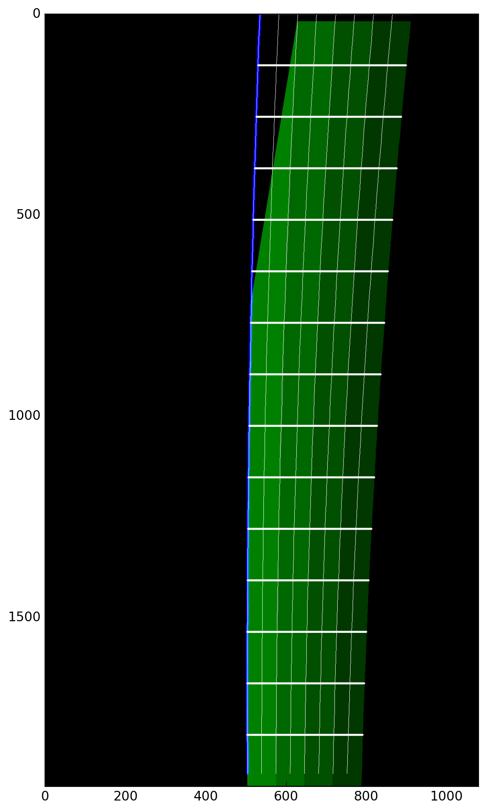
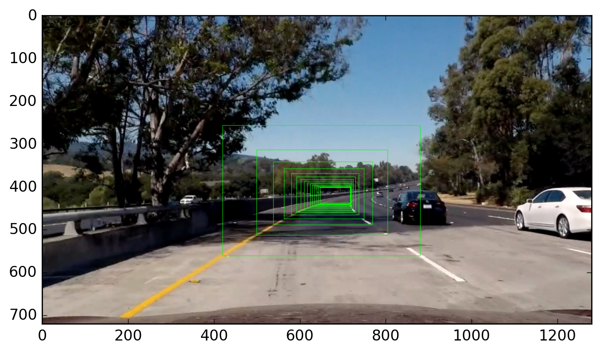

# Advanced  Lane Finding

The goals / steps of this project are the following:

* 
*
*


[//]: # (Image References)
[test5]: ./test_images/test5.jpg
[rEdgeDetect]: ./output_images/lane_detection/rEdgeDetect.png
[HLS]: ./output_images/lane_detection/1280px-HSL_color_solid_cylinder_alpha_lowgamma.png
[final_edge]: ./output_images/lane_detection/final_edge.png
## Implementation details


### 1. Camera Calibration

The goal of camera calibration is distortion correction. Image distortion occurs when a camera looks at 3D objects
in the real world through lens and transform them into a 2D image.
The distortions in an image can:
* Change the apparent size of an object.
* Change the apparent shape of an object.
* Cause an object's appearance to change depending on where it is in the field of view (FOV).
* Make objects appear closer or father away than they actually are.

Cameras use curved lenses to form an image, and light rays often bend a little too much or too little 
at the edges of these lenses. This creates an effect that distorts the edges of images, so that lines or objects
appear more or less curved than they actually are. This is called **radial distortion**, and it is the most common type
of distortion. Another type of distortion, is **tangential distortion**. This occurs when a camera's lens is not aligned
perfectly parallel to the image plane, where the camera film or sensor is. This makes an image look tilted
so that some objects appear father away or closer than they actually are. To correct for these
two types of distortions, a camera calibration is needed (usually via chessboard images).

This is done in `main.py` (by calling `lib/cameraCal.py`) as:
```python
camCal = CameraCal('camera_cal', 'camera_cal/calibrationdata.p')
```

Next I describe the lane finding steps in `roadMgr.findLanes(img, resized=resized)`.
### 2. Image Filters


The imageFilter module will apply filters to an image to isolate the pixels that makes the lane lines. 
The details steps are given as follows:

#### RGB colorspace thresholding

One of the most difficult lane lines to isolate are the yellow lane lines. 
This becomes particularly difficult when yellow lane lines in images with poor visibility.
Using thresholding the red channel can render this image in `imageFilters.py`:
```python
        # create the Red filter
        rEdgeDetect = img[:, :, 0] / 4
        rEdgeDetect = 255 - rEdgeDetect
        rEdgeDetect[(rEdgeDetect > 210)] = 0
```
This filter compressed the red color to 1/4 of its original value and inverts it so that its lowest 
value now becomes its highest. Then a threshold is selected to drop any value higher than it to be 0.

![test5][test5]
![rEdgeDetect][rEdgeDetect]

#### Sobel Thresholding.

Larger sobel kernel size will provide a softer smoother gradient image. For X direction,
a threshold of (25, 100) and for Y direction (50, 150) is applied.
```python
        gradx = self.abs_sobel_thresh(self.curRoadGray, orient='x', thresh=(25, 100))
        grady = self.abs_sobel_thresh(self.curRoadGray, orient='y', thresh=(50, 150))
```

#### Sobel magnitude and directional
A threshold for magnitude is (50, 250) and  (0.7, 1.3) is applied to directional (angular space).
```python
self.magch = self.mag_thresh(self.curRoadGray, sobel_kernel=9, mag_thresh=(50, 250))
dirch = self.dir_threshold(self.curRoadGray, sobel_kernel=15, thresh=(0.7, 1.3))
```

#### HLS colorspace thresholding

HLS (Hue, Lightness and Sturation):
**Hue** represents color independent of any change in brightness. 
**Lightness** represents luminacity or brightness, and can be compared to converting an RGB image
ti grayscale.
**Saturation** is a measurement of *colorfulness* as compared to *whitenss*. 

![HLS][HLS]

For lane findings, **Lightness** color channel is dropped as a means of filtering and only 
**Hue** and **Saturation** color channels are considered. The special case where yellow lane lines
against white background is of interest since the Sobel filter excels in edge detection based on luminance already.
The **Hue** channel is a good candidate for filtering yellow lines, and **Saturation** (value of color away from white)
will also help.

```python
        sch = self.hls_s(self.curRoadHLS, thresh=(88, 250))
        hch = self.hls_h(self.curRoadHLS, thresh=(50, 100))
```

These two filters appear to be mutually exclusive. **Hue** can be used to mask out the white background,
**Saturation** can be used for finding the yellow lane lines.

The final combined detection is shown as:
![final_edge][final_edge]

Of course, this is a pure computer vision technique, with machine learning, especially
deep learning with convolutional neural networks, there are great variety of choices in 
terms of performance and execution of speed. For example: [KITTI Road/Lane Detection Evaluation 2013.](http://www.cvlibs.net/datasets/kitti/eval_road.php)

### 3. Hough Line

To find the main lane lines (the lane where the car is currently driving), 
we have a region-of-interest (ROI) mask and then using Hough transforms to find main lane lines as follows:

ROI mask                                      |  Maksed edges                                 |   Hough Lines |
:-------------------------:                   |:-------------------------:                    | :-------------------------:|
  |   | |

### 3. Perspective to Plane Transform

The pinwhole camera model can be found [here](https://en.wikipedia.org/wiki/Pinhole_camera_model):
 

A `cv2.solvePnP` function is ued to find the rotation and translation vectors:

```python
            ret, self.rvecs, self.tvecs = cv2.solvePnP(
                self.cur3DDstRoadCorners.reshape([4, 1, 3]),
                self.curSrcRoadCorners.reshape([4, 1, 2]),
                self.mtx, self.dist, flags=cv2.SOLVEPNP_ITERATIVE)
```

Bird Eye View                                    |  Bird Eye View of Lane lines           |                           
:-------------------------:                      |:-------------------------:            |                    
  |   | 


### 4. Finding multiple Lanes

The following code in `roadManager.py` add left and right lanes accordingly:
```python
            # find lane lines left and right
            curLane = mainLane
            while curLane is not None and curLane.adjacentLeft and curLane.adjacentLLane is None:
                self.addLaneLeft(curLane)
                curLane = curLane.adjacentLLane
            curLane = mainLane
            while curLane is not None and curLane.adjacentRight and curLane.adjacentRLane is None:
                self.addLaneRight(curLane)
                curLane = curLane.adjacentRLane
```
Projected multi-lanes                                   |  Projected multi-lanes in real 3D        |                           
:-------------------------:                             |:-------------------------:            |                    
  |   | 
